

# Open Space

**Максим Кухто · [@kukhtik](https://github.com/kukhtik)**

Агентные системы · Офлайн-RAG · Контуры верификации инструментов · Численная инженерия

*Скриншоты — с рабочих сборок; каждое число — из измеренного прогона. Проприетарные внутренности (медицинская документация, лицензионная логика, численные процедуры) остаются закрытыми — архитектуры, интерфейсы и метрики описаны здесь.*

🇬🇧 [English version](README.md)

---

## Swarm — мультиагентная оркестрация с машинной приёмкой

**Проблема.** LLM-агенты отчитываются «готово», когда работа не сделана — молча падают, оставляют заглушки, зацикливаются. Одиночный агент, проверяющий себя сам, страдает подтверждающим искажением.

**Подход.** Изоляция ролей: планировщик декомпозирует задачу в проверяемые шаги, исполнитель делает работу, верификатор открывается с чистым контекстом и судит исполнение — pytest, линтер, dry-run — а не слова агента.

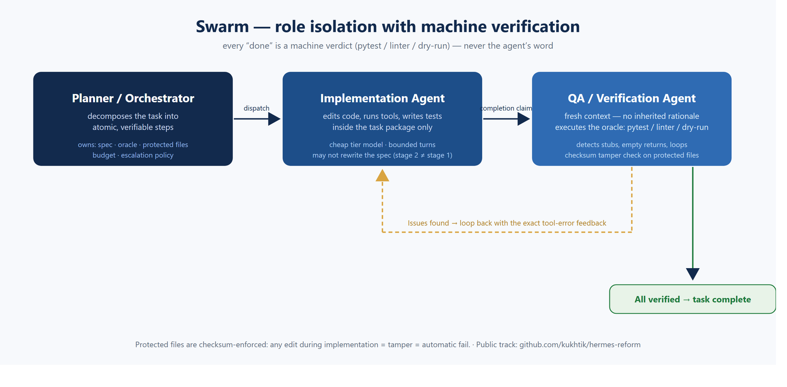

| Механизм | Как устроен |
|---|---|
| **Изоляция ролей** | Планировщик / исполнитель / верификатор — разные личности и контексты |
| **Закрытая петля** | Выход каждого инструмента проверяется детерминированно до следующего шага |
| **Защита границ** | Файлы `scope.protected` прибиты SHA-256; правка = автопровал задачи — ловятся и правки, и удаления (проверено механически) |
| **Бюджет и эскалация** | Ограниченные ходы и попытки; после N провалов — эскалация к сильной модели или человеку по политике из пакета задачи |

Референсный прогон (`demo-calc-bugfix`): оракул `python test_calc.py` → `ALL TESTS PASSED`, 11/11 проверок зелёные, 4 хода, 21 с, tamper false.

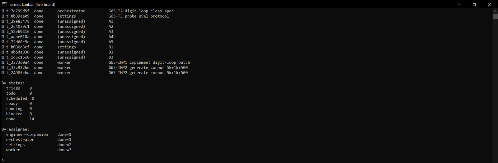

**Открытый код:** [hermes-reform](https://github.com/kukhtik/hermes-reform) — 21 влитая ветка реформы (стабильность ядра, security-база, desktop-стабильность), CI + независимое ревью моделями. Там же runbook сопутствующего мультипрофильного шлюза: один Telegram-бот на 13 профилей агентов через DM-топики (маршрутизация thread → профиль).

**Стек:** Python · Hermes Agent (канбан-диспетчер, middleware) · pytest как оракул · SHA-256 tamper-check · JSONL-траектории.

---

## Engineer Companion — офлайн-RAG по документации медоборудования

**Проблема.** Сервисный инженер у линейного ускорителя (Varian TrueBeam / VitalBeam) работает в бункере без интернета и должен за секунды найти точную страницу спецификации среди десятков тысяч страниц.

**Подход.** Полностью локальный гибридный поиск с проверяемыми ссылками на источник: документ, страница, область чертежа. Работает на CPU.

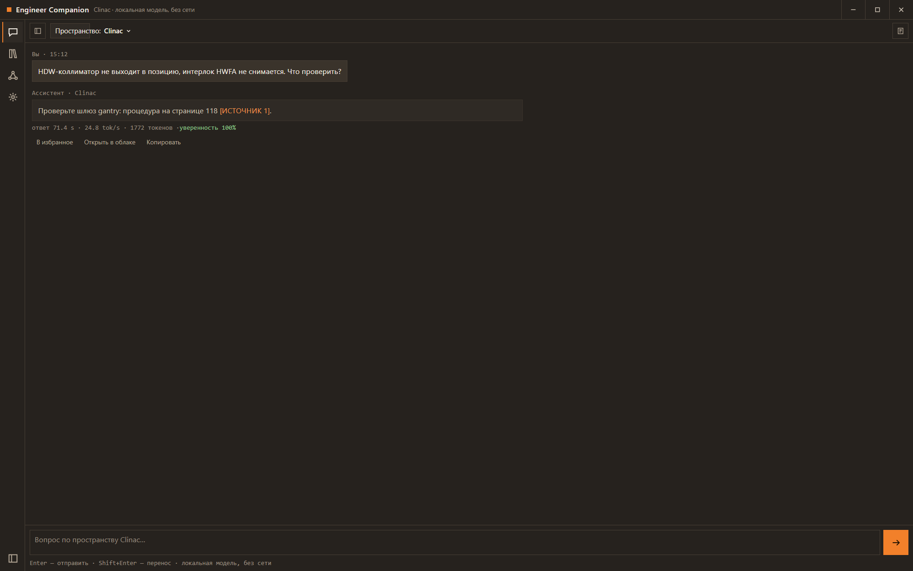

| Метрика | Значение |
|---|---|
| Качество каталога фактов | **96 / 100** на бенчмарке `grounded-qa-100-v1` (100 кейсов) |
| Латентность | **p50 130 мс** · p95 1 193 мс |
| Масштаб | **21 214 фактов** поверх индекса 71 862 строк (вектор + BM25) |
| Тесты | **768 / 775** проходят |

<table>
<tr>
<td width="50%">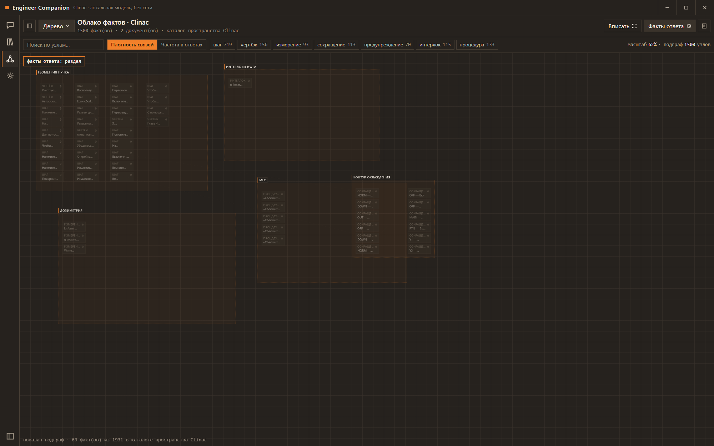 Облако фактов — каталог Clinac как граф узлов</td>
<td width="50%">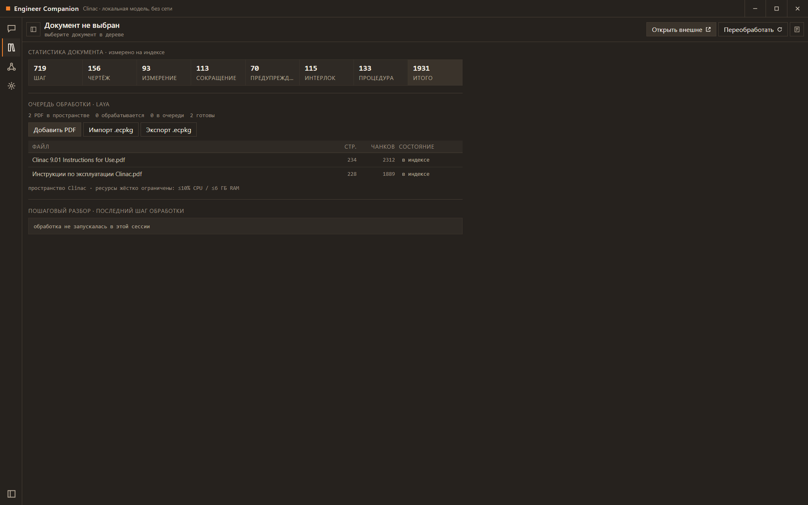 Библиотека документов и статистика индекса</td>
</tr>
</table>

**Стек:** Python · LanceDB (вектор) + BM25 (гибрид) · эмбеддинги multilingual-e5-small + реранкер mmarco cross-encoder · Gemma-3-4B (GGUF, llama.cpp) · оболочка PySide6; Android-оболочка на Compose + ONNX Runtime Mobile.

---

## GeoConverter — численная калибровка геодезических координат

**Проблема.** Перевод координат между унаследованными локальными системами и современными глобальными датумами (WGS-84) требует субмиллиметровой точности при сильных нелинейных искажениях. (Конкретные системы и зоны — конфиденциальны.)

**Подход.** Четырёхстадийный численный конвейер с обратной проверкой: замкнутый маршрут должен сойтись в пределах миллиметров.

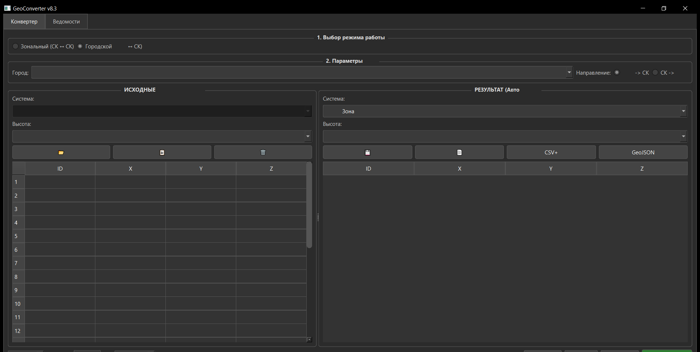

Опорные точки → **Helmert 3D (SVD)** → **Левенберг–Марквардт** → **Нелдер–Мид** (допуск 1e-12) → контроль ошибки замкнутого маршрута.

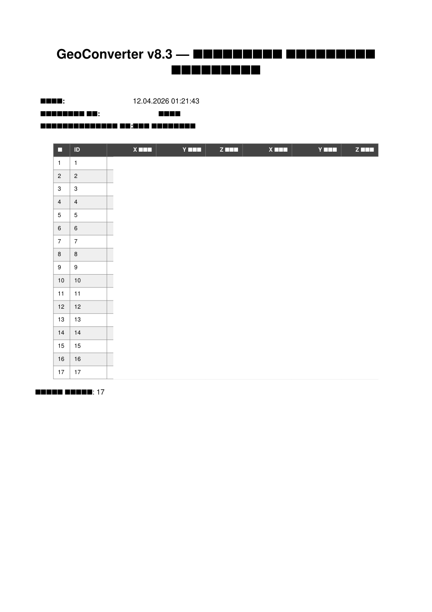

**Коммерческий desktop-продукт** (Windows 7/10): аппаратно-привязанные ключи активации без внешнего сервера, встроенный выпуск лицензий, UI на PyQt6, автоматический разбор смешанных данных из AutoCAD, CSV и Excel.

**Стек:** Python · NumPy / SciPy (least_squares, SVD) · PyQt6 · PyInstaller / Nuitka.

---

## VETKA_DWG — полевые абрисы → чертежи CAD

**Проблема.** Геодезист рисует полевой абрис (набросок с нумерованными точками) и потом часами переносит его в CAD.

**Подход.** Фото абриса → распознавание маркеров и текста → топографический DXF/DWG. **4 часа ручного черчения → 15 минут.** В продакшене у геодезических компаний (Беларусь).

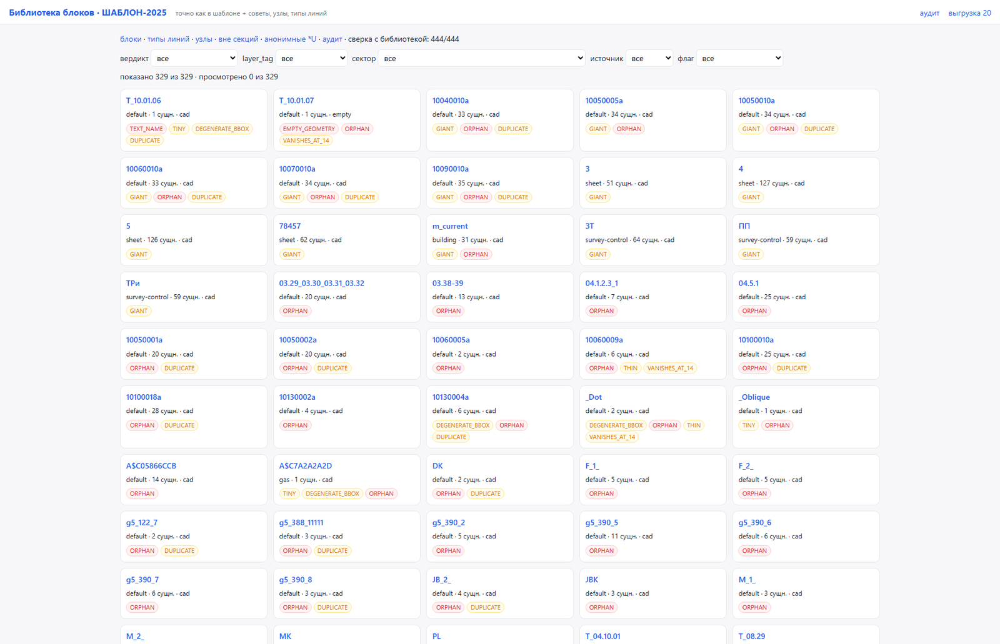

На скриншоте — консоль аудита библиотеки блоков: **444 / 444 блока проходят все пять осей точности** относительно эталонного шаблона (библиотека знаков ГУГК, ШАБЛОН‑2025).

**Стек:** Python · собственный CV-пайплайн (детекция маркеров, OCR) · ezdxf · библиотека знаков ГУГК на 444 блока · PySide6 / QML · CI с quality gates.

*Исходники закрыты (коммерческое использование); здесь описаны архитектура и результаты аудита.*

---

## PenaPivo / BeerLog — serverless Telegram-бот + Mini App

**Что это.** Живой Telegram-продукт: пивной журнал дегустаций с записями, статистикой, карточками профиля и рейтингами.

<table>
<tr>
<td width="24%">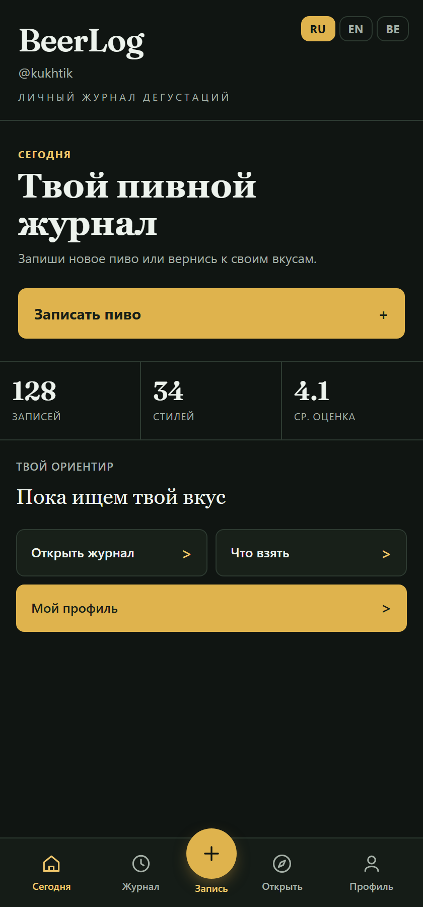 Mini App — журнал дегустаций (демо-данные)</td>
<td>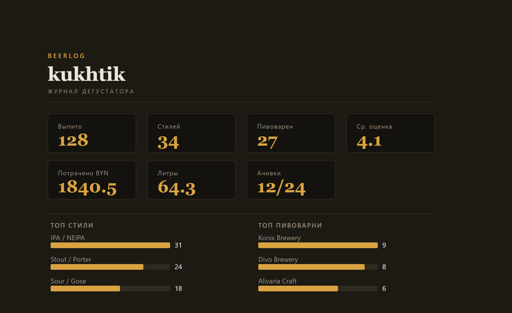 Карточка профиля из модуля бота (SVG; демо-данные)</td>
</tr>
</table>

**Архитектура:** Cloudflare Workers (edge) · D1 (SQL) · R2 (бэкапы) · Telegram Mini App с i18n (ru/en/be) · CI: coverage-gate **≥84% ветвей** + mutation testing (Stryker).

**Живой бот:** [@PenaPivo_bot](https://t.me/PenaPivo_bot)

**Стек:** JavaScript (ESM) · Cloudflare Workers / D1 / R2 · Node.js · resvg (растеризация карточек).

---

## VTuber Rigger — авто-риггинг: модель или скриншоты → VRM 1.0

**Проблема.** Риггинг VTuber-аватара — скелет, скин-веса, выражения, spring-bones — занимает часы ручной работы в Blender, а реконструкция из плоского изображения (скриншоты) сложнее вдвойне.

**Подход.** Два пути, полностью локально (без платных API): **Path A** — 3D-модель (GLB/GLTF/VRM/OBJ) → VRM 1.0; **Path B** — скриншоты спереди/сбоку/сзади → VRM 1.0. Сегментация тела на K-Means + кривизне, предиктор 53-костного VRM-скелета, скин-веса RBF + Laplacian, 17 выражений, spring-bones для волос/одежды, QA-гейты headless-VRM и LPIPS/CLIP.

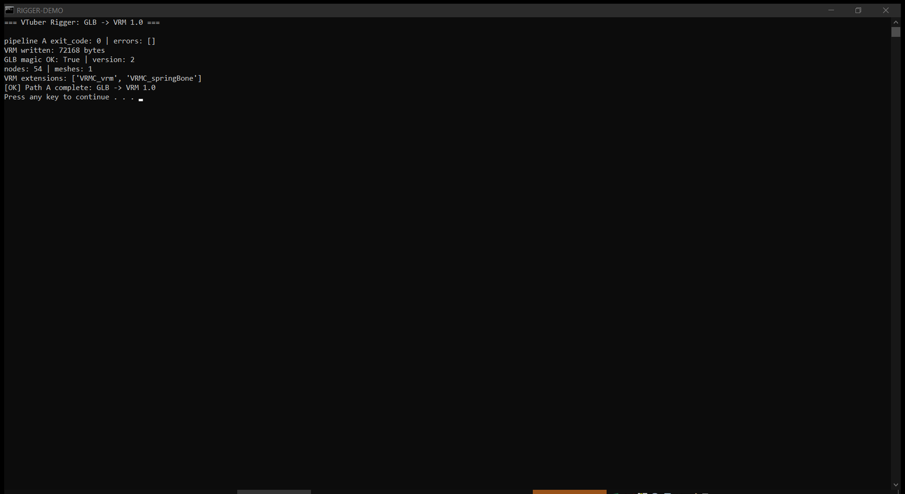

Референсный прогон на тестовой меш-модели: `GLB → VRM`, exit 0, **54 узла, 1 меш, расширения `VRMC_vrm` + `VRMC_springBone`**.

**Стек:** Python · trimesh · pygltflib · numpy / scipy / scikit-learn · OpenCV · pytest (unit + integration + property + perceptual). Публичный: [github.com/kukhtik/RIGGER](https://github.com/kukhtik/RIGGER).

---

## Neuro Property Trade — детерминированный игровой движок + AI-места

**Проблема.** Коммерческую настольную игру нельзя безопасно модифицировать для игры ИИ (анти-тампер, снятые с продажи версии, нет чистого доступа к состоянию). Чтобы ИИ-место играло честно, сама игра должна быть построена так, чтобы состоянием владел движок — а не ИИ.

**Подход.** Самостоятельная игра на Godot 4 с детерминированным движком правил: seeded RNG течёт через один класс, каждое действие идёт через append-only лог событий (полный replay), а ИИ-места (Neuro / Evil Neuro / человек) отправляют **интенты** — движок их валидирует и исполняет; ИИ не может испортить состояние. Оригинальный сеттинг, без чужих торговых марок.

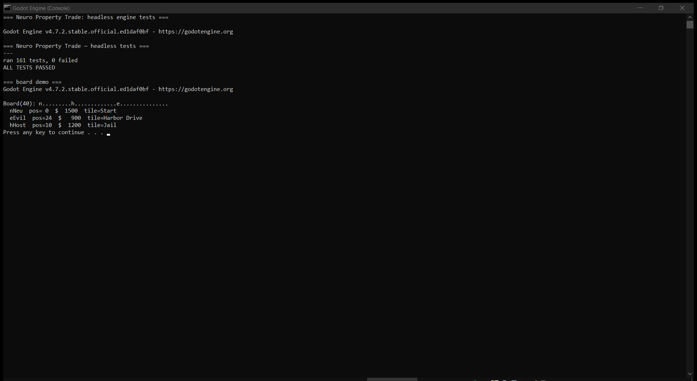

Живой прогон: **161 headless-тест зелёный**, затем ASCII-снимок доски (позиции, кэш, клетки по местам).

**Стек:** Godot 4.7 (GDScript) · headless-тестируемое ядро · адаптер Neuro SDK (WS протокол действий, реестр действий, контекст хода). Публичный: [github.com/kukhtik/neuro-property-trade](https://github.com/kukhtik/neuro-property-trade).

---

## Hermes Viz — телеметрическая консоль агентной фермы

**Проблема.** Мультиагентная ферма (21 агент, 9 моделей, асинхронная доска задач) непрозрачна с одного взгляда: кто что делает, где задача встала, что реально отдаёт база знаний.

**Подход.** Один экран с тремя фасетами поверх **живых данных**: **OPS** — радиальный «ролодекс» живой команды (статус, модель, текущий инструмент, активность); **PIPELINE** — доска задач с зависимостями, прогонами и блокировками; **KNOWLEDGE** — граф репозитория (2 292 узла, 839 рёбер) с потоком ретривала.

<table>
<tr>
<td width="50%">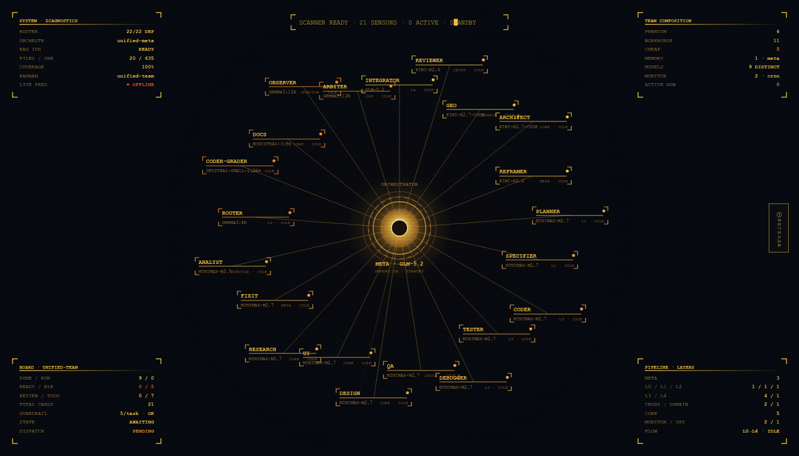 OPS — живая команда как сенсор-ролодекс</td>
<td width="50%">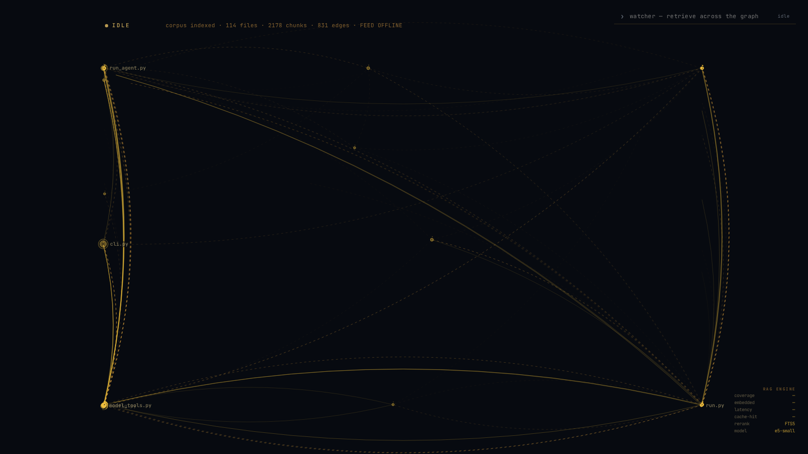 KNOWLEDGE — граф репозитория, 2 292 узла</td>
</tr>
<tr>
<td colspan="2">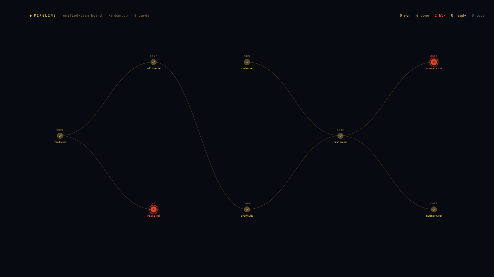 PIPELINE — доска задач с прогонами и блокировками</td>
</tr>
</table>

**Стек:** JavaScript (canvas-консоль) · WebSocket-поток событий · SQLite (канбан-БД) · семантический граф с рёбрами импортов и эмбеддингов.

---

## Codebot — Telegram-мост к кодинг-агенту

**Проблема.** Кодинг-агент работает на станции, но управлять им с телефона не должно требовать ноутбука.

**Подход.** Telegram-бот на Java 21 без зависимостей (63 класса, ~10,9k строк, обычный `javac` — без Maven/Gradle): мост к локальному серверу кодинг-агента по JSON-RPC/WebSocket — живые состояния хода, аппрувы, переключение/импорт/архив сессий, вложения, срочный steering; режим, где каждый пользователь подключает свою машину.

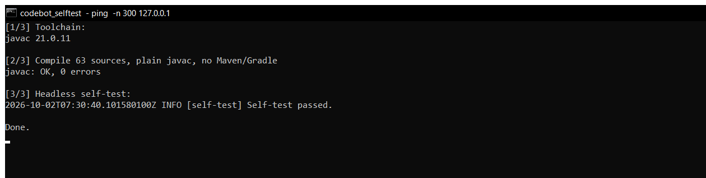

Референсный прогон: **63 исходника компилируются обычным `javac` (0 ошибок)**, встроенный headless self-test проходит.

**Стек:** Java 21 (без build-системы) · Telegram Bot API (long polling + webhook) · JSON-RPC поверх WebSocket · Docker Compose + Playwright-sidecar для браузерных инструментов. *(Исходники локальные; здесь описана архитектура.)*

---

## Storybeam — пайплайн AI-видео (активный форк)

**Что это.** Активный форк [MoneyPrinterTurbo](https://github.com/harry0703/MoneyPrinterTurbo), перестроенный в платформу: React-фронтенд поверх REST API, длинные форматы, контроль затрат, комплаенс.

**Что изменили** (56 коммитов, +14 955 / −6 559 строк в 108 файлах):

| Область | Изменение |
|---|---|
| **Длинные форматы** | сценарий чанками по длительности; resume/idempotency по сценам; ограничение числа сцен |
| **Контроль затрат** | дозированный image-to-video (хук + главы) + лимит расходов на задачу (`LongFormCostGovernor`) |
| **Комплаенс** | раскрытие AI-синтетики при загрузке; защита от вводящих метаданных; структурное варьирование (анти-шаблонность) |
| **Продукт** | полный React UI Create / Library / Settings с API-key gate; Telegram-бот полного паритета (deny-by-default multiuser) |
| **Безопасность** | API-авторизация включена по умолчанию, bind 127.0.0.1, фикс path traversal, редакция секретов в логах |

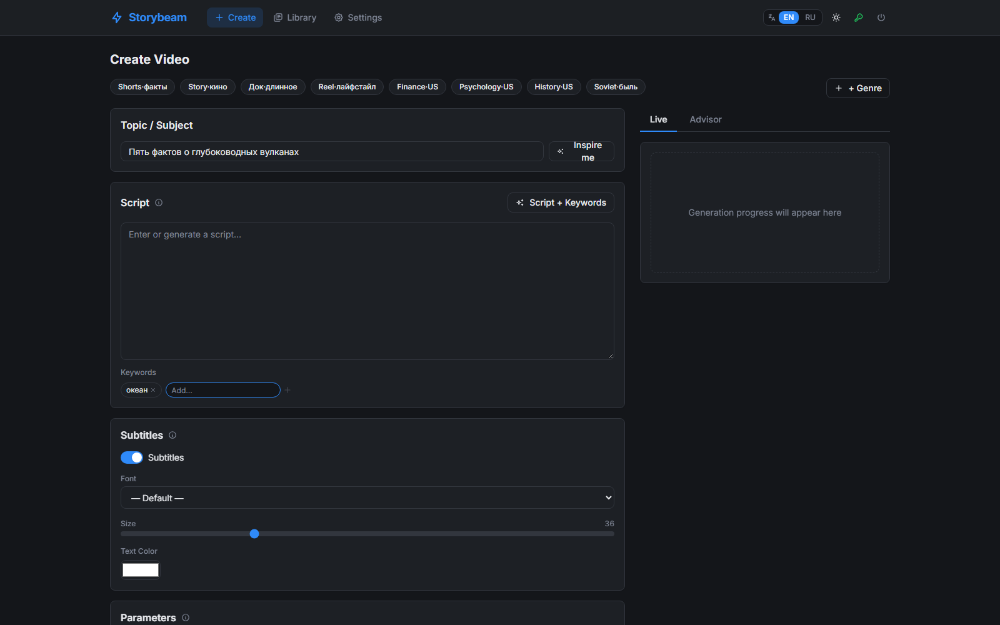

**Стек:** Python / FastAPI · React 18 + TypeScript + Vite + Tailwind · Redis (состояние задач) · ffmpeg · Docker.

---

## Торговый исследовательский стенд — систематическая валидация стратегий

**Проблема.** Большинство «прибыльных» розничных стратегий умирают после комиссий и слиппеджа; обычный бэктест это как раз и скрывает.

**Подход.** Исследовательский стенд, а не сигнальный бот: walk-forward бэктесты с комиссиями, слиппеджем и фандингом; явные проверки look-ahead bias (сдвиг сигналов на бар); CPCV-консистентность (combinatorial purged CV); риск-контроль (сайзинг, circuit breaker, kill-switch). Paper-режим работает без ключей.

**Измеренный свип** — 33 стратегии на 4 таймфреймах: выше порога PF > 1.1, p < 0.10 и ≥ 30 сделок остаются единицы. Пример на 4h: **PF 1.44, 2 526 сделок, CPCV-консистентность 82%**. Сравнение за тот же год: breakout +6.4% против buy & hold **−52.7%** — активное управление защитило капитал микросчёта.

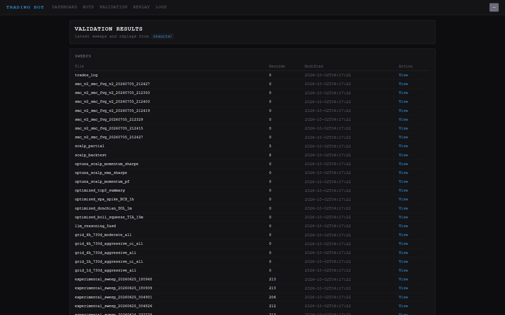

**Стек:** Python · CCXT · pandas / Parquet · FastAPI + Jinja2 web UI · systemd-юниты. *(Исследовательский стенд — только оценка, не сигналы.)*

---

## Streaming stateful prediction — исследовательская задача

**Проблема.** Модель должна предсказывать цель по одной строке за раз в потоке: каждая строка зависит от всей предыдущей истории, окно — десятки тысяч строк, а метрика считается блоками внутри последовательности (корреляция, а не MSE). Обычные рецепты (нарезка окнами, MSE-лосс) здесь не работают.

**Подход.** Stateful-рекуррентная модель (GRU, пошаговый экспорт в ONNX) со строгим контрактом состояния: инференс по одной строке, hidden state переносится между вызовами. Ключевое — **метрико-выровненный лосс**: реализация официального блочного агрегата на torch, побитово сверенная со скорером, и корреляция, накапливаемая по всей последовательности (а не по короткому окну, где цель почти постоянна и сигнал тонет в шуме).

Инженерные рычаги, проверенные на практике:

| Рычаг | Результат |
|---|---|
| Метрико-выровненный лосс | одиночная модель обошла лучший ансамбль |
| Горизонт корреляции | на полном окне сигнал в 4–5× сильнее, чем на коротком сегменте |
| Трансформация фич внутри ONNX-графа | наивный пересчёт фич не влезал в лимит инференса; in-graph — влезает с запасом 1.38× |
| Перепроверка документации стакана | заявленная раскладка bid/ask оказалась ложной — найдена перебором пар на 500k строк |

Отдельный пласт — **устойчивость инфраструктуры**: обучение шло на GPU с 4 ГБ в WSL, который молча рестартовал под нагрузкой (утечка page cache через 9p-мост). Решение — `posix_fadvise(DONTNEED)` на каждую группу parquet; кэш стабилизировался.

*Задача соревновательная: подход и инженерные уроки описаны, конкретные данные, метрики и код не публикуются (правила площадки).*

---

## Neuro Property Trade — детерминированный движок + собственный UI

**Проблема.** Настольную игру нельзя безопасно модифицировать для игры ИИ: анти-тампер, нет чистого доступа к состоянию.

**Подход.** Движок владеет состоянием, ИИ присылает **интенты**: seeded RNG через один класс, каждое действие — в append-only лог событий (полный replay), ИИ не может испортить состояние. Собственный интерфейс на Godot 4 — параметрическое поле (никаких захардкоженных 40 клеток), живая перекладка под размер окна, RU/EN, светлая/тёмная тема, панель мест и журнал событий.

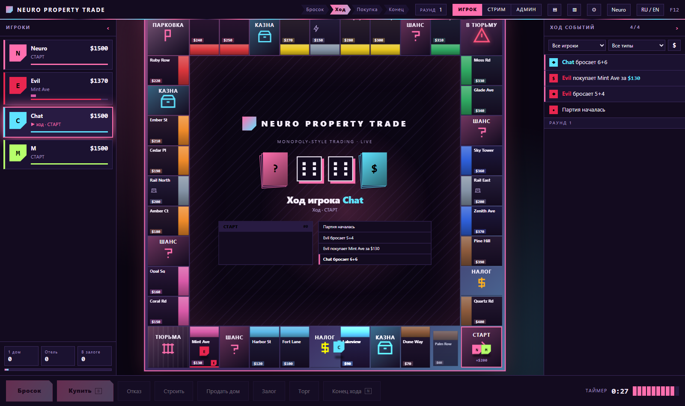

Партия за столом: параметрическое поле, кубики, журнал событий, панель мест.

**Стек:** Godot 4 (GDScript) · headless-тестируемое ядро · адаптер Neuro SDK (WS-протокол действий, реестр действий, контекст хода). Публичный: [github.com/kukhtik/neuro-property-trade](https://github.com/kukhtik/neuro-property-trade).

---

## Стек

| Область | Технологии |
|---|---|
| **Языки** | Python (основной), JavaScript / TypeScript, Java 21, GDScript, SQL, Kotlin, Rust (базово) |
| **AI / LLM** | llama.cpp / GGUF, ONNX Runtime, LanceDB, эмбеддинги + cross-encoder реранкинг, агентные контуры (Hermes Agent, Claude Code, Codex) |
| **3D / игры** | Godot 4 (headless-тестируемые детерминированные движки), VRM 1.0 / glTF, trimesh, Blender-тулчейн |
| **Backend** | FastAPI, Redis, Cloudflare Workers, D1, R2, SQLite / PostgreSQL, Kafka / gRPC |
| **Фронтенд** | React 18 + TypeScript (Vite, Tailwind), canvas-визуализации на JS, PySide6 / PyQt6 / QML, Telegram Mini Apps, Compose (Android) |
| **Численные методы** | NumPy / SciPy, Helmert / SVD, Левенберг–Марквардт, Нелдер–Мид, walk-forward / CPCV бэктестинг |
| **Инфраструктура** | Docker, Linux / WSL, Git, GitHub Actions / GitLab CI, Cloudflare, systemd |
| **Качество** | pytest, coverage-gates, mutation testing, SHA-256 tamper-checks, проверки look-ahead bias, JSONL-траектории |

---

**[github.com/kukhtik](https://github.com/kukhtik)** · [linkedin.com/in/max-kukhto-517091337](https://www.linkedin.com/in/max-kukhto-517091337/) · maxkukhto@gmail.com · Могилёв, Беларусь (удалённо)

Интерфейсные скриншоты — с рабочих сборок; данные, идентифицирующие заказчика (названия объектов, локальные системы координат, номера зон, каталоги координат), замаскированы. В чате EC и кадрах BeerLog — демо-контент. Каждая метрика — из измеренного прогона.

